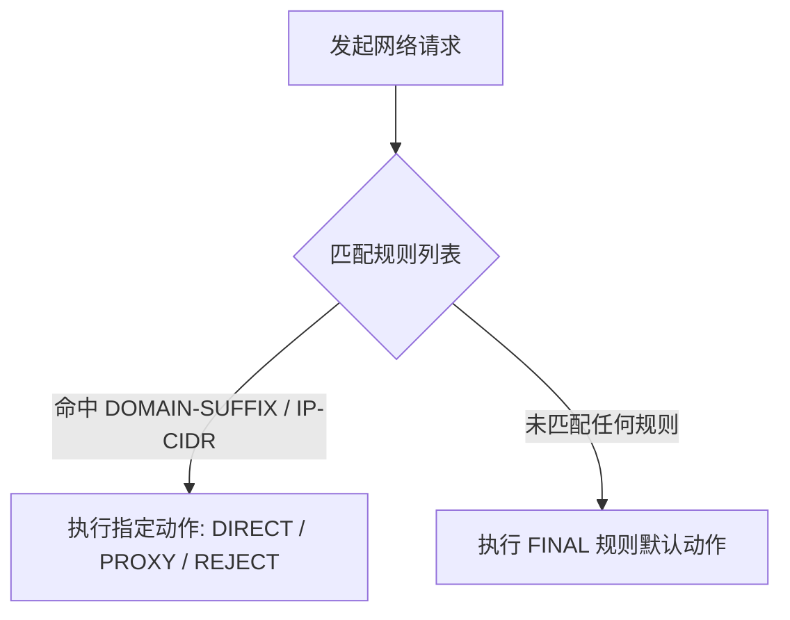

Shadowrocket（小火箭）不仅仅是一个简单的节点连接工具，其核心威力在于强大的**分流规则引擎与脚本重写功能**。通过合理配置规则，你可以让国内流量直连、国外流量走节点、影视媒体走专线，还能有效过滤应用内广告。

本文将系统讲解小火箭的配置规则逻辑、远程规则导入方法以及高级脚本重写（Rewrite & MITM）实战。

---

## Shadowrocket 的四大路由模式

在小火箭主界面中，点击“全局路由”可切换不同的工作模式：

1. **配置 (Config)** **[推荐]**：根据预设的规则列表智能决定流量去向。国内网站直连，境外受限网站通过代理，既节省流量又保证速度。
2. **代理 (Proxy)**：所有网络流量强制通过当前选中的代理节点发送。
3. **直连 (Direct)**：所有流量绕过代理，直接连接目标服务器。
4. **场景 (Scene)**：根据连接的 Wi-Fi 名称或 cellular 移动网络自动切换路由策略。

---

## 导入第三方优质分流规则

默认的规则往往较为简陋，推荐导入社区维护的高质量分流规则库（如 ACL4SSR 或 Blackmatrix7）：

### 1. 远程配置导入步骤
- 打开 Shadowrocket，点击底部导航栏的 **“配置”** 标签。
- 点击右上角的 **+** 加号按钮。
- 在“远程文件”输入框中粘贴规则 URL（例如 ACL4SSR 精简版规则）。
- 点击“下载”，成功后在列表中点击该配置文件，选择 **“使用配置”**。

### 2. 常用远程规则库对比

| 规则库名称 | 特点说明 | 适合人群 |
| :--- | :--- | :--- |
| **ACL4SSR 精简版** | 去重优化良好，涵盖主流国内外域名分流 | 大多数普通用户首选 |
| **ACL4SSR 重度去广告** | 整合大量广告拦截规则，过滤追踪器 | 追求极致干净界面的用户 |
| **Blackmatrix7 (iOS规则)** | 按应用和流媒体精准拆分（Netflix/YouTube/ChatGPT） | 需要针对特定 App 定制节点的用户 |

---

## 分流规则匹配顺序与动作

小火箭在处理一条网络请求时，遵循**从上到下按顺序匹配**的原则。一旦找到匹配项即执行对应动作：

### 常见规则动作说明：
- **DIRECT**：直连，不经过代理。
- **PROXY / GROUP**：走指定代理节点或节点分组。
- **REJECT**：拒绝连接（直接丢弃请求，常用于拦截广告与统计上报）。
- **FINAL**：兜底规则，处理所有未明确列出的请求。

---

## 脚本重写 (Rewrite) 与 HTTPS 解密 (MITM)

重写功能允许小火箭在本地对网络请求的 URL 进行修改、重定向，甚至通过 JavaScript 脚本动态篡改返回的 JSON 数据，实现精细化去广告和解锁功能。

### 步骤一：生成并安装 CA 证书 (开启 MITM)
由于现代网络全面普及 HTTPS 密文传输，要重写应用内部请求，必须开启中间人攻击解密 (MITM)：

1. 点击小火箭【配置】-> 点击当前生效配置文件后面的 i 图标。
2. 选择 **“HTTPS 解密”**，开启开关。
3. 点击 **“生成新的 CA 证书”** -> 选择 **“安装证书”**。
4. 系统会下载配置描述文件。打开 iPhone【设置】->【已下载描述文件】完成安装。
5. **非常关键的步骤**：打开 iPhone【设置】->【通用】->【关于本机】-> 证书信任设置，找到 Shadowrocket CA 证书，开启**完全信任开关**。

### 步骤二：启用 Rewrite 重写规则
在配置文件详情中打开 **“重写 (Rewrite)”** 开关。此时远程规则中的 URL 重定向与广告拦截脚本便会自动在后台生效。

> **提示：** 开启 HTTPS 解密仅建议用于 trusted 证书与特定去广告域名，避免对金融银行 App 开启解密。

---

## Shadowrocket 规则与重写答疑 (FAQ)

### Q1：为什么导入了规则后某些国内 App 打不开了？
可能是规则冲突或 DNS 污染所致。尝试在【设置】->【DNS】中，将本地 DNS 修改为国内公共 DNS（如 223.5.5.5 或 119.29.29.29），并将远程 DNS 设为 1.1.1.1。

### Q2：开启 HTTPS 解密会不会影响手机支付安全？
小火箭的 MITM 机制仅对你在配置文件中明确指定的域名进行解密，对支付宝、微信支付、银联等金融域名默认不做拦截处理。只要不随意导入未知来源的全局 MITM 证书，安全性是完全有保障的。

---

## Shadowrocket 规则配置总结

学会使用分流规则与脚本重写，可以让你的小火箭实现“无感科学上网”。合理搭配第三方规则库与代理节点，既能大幅提升网页加载速度，又能过滤烦人的应用开屏广告。