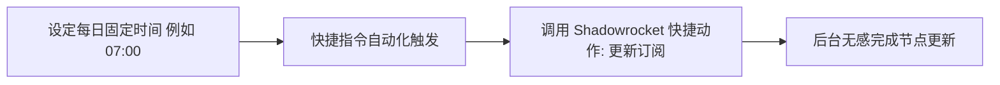

在科学上网过程中，机场服务商会定期更换被封锁的节点 IP、调整线路负载或更新服务器域名。如果你的客户端没有及时同步最新订阅，经常会出现**节点大面积超时或无法连接**的情况。

本文将详细教你如何在 Shadowrocket（小火箭）中配置**定时自动更新订阅**与后台刷新功能，彻底告别手动更新的麻烦。

---

## 为什么必须开启订阅自动更新？

1. **实时同步节点变动**：机场添加新节点或维修故障服务器时，自动更新能在第一时间拉取最新节点列表。
2. **防被封锁节点残留**：自动删除失效或废弃的服务器配置，避免列表中充斥大量不可用的“-1ms”节点。
3. **获取最新分流规则**：如果订阅链接中包含机场定制的分流策略，自动更新可以同步最新的域名分流规则。

---

## 步骤一：开启小火箭内置的“打开时更新”与“定时更新”

Shadowrocket 本身提供了灵活的订阅更新控制选项：

```
设置路径：
Shadowrocket 主界面 -> 底部【设置】菜单 -> 点击【订阅】(Subscribe)
```

### 关键配置开关详解：

- **打开时更新 (Update on Open)**：【强烈建议开启】每次你点开小火箭 App 时，软件会在后台静默请求订阅链接并刷新节点。
- **自动后台更新 (Auto Update)**：【建议开启】允许软件在隔定时间段自动联网刷新。
- **更新间隔 (Update Interval)**：建议设置为 24 小时 或 12 小时。频繁更新不仅消耗流量，还可能触发机场订阅接口的请求频次限制。
- **排序 (Sort)**：可选择按“延迟”或“节点名称”排序，保持界面整洁。

---

## 步骤二：开启 iOS 系统级【后台 App 刷新】权限

即使在小火箭内开启了自动更新，如果 iOS 系统剥夺了其后台运行权限，定时更新依然无法按时触发：

1. 打开 iPhone 的 **【设置】(Settings)**。
2. 向下滚动找到 **【Shadowrocket】** 应用。
3. 确保 **【后台 App 刷新】(Background App Refresh)** 开关处于**绿色开启状态**。
4. 确保 **【无线局域网与蜂窝网络】** 权限已完全授予。

---

## 步骤三：利用 iOS “快捷指令”实现每日定点自动更新（高级技巧）

由于 iOS 系统的后台唤醒机制较为严格，你可以使用 iPhone 自带的【快捷指令】(Shortcuts) 创建自动化任务，每天固定时间自动触发订阅更新：



### 配置操作步骤：
1. 打开 iPhone 内置的 **【快捷指令】** App。
2. 切换到 **【自动化】** 标签页，点击右上角 + 创建个人自动化。
3. 选择 **“特定时间”**（如每天早上 07:00）。
4. 在添加操作中搜索 **“Shadowrocket”**。
5. 选择动作 **“Update Subscriptions” (更新订阅)**。
6. 取消勾选“运行前询问”，点击完成。从此每天早上手机都会自动拉取最新节点。

---

## 订阅更新失败的常见原因与排查表

| 失败现象 | 根本原因分析 | 解决办法 |
| :--- | :--- | :--- |
| **提示 Invalid URL** | 订阅链接复制不完整或包含空格 | 重新在机场后台复制通用 Clash/Shadowrocket 订阅链接 |
| **提示 Network Error** | 当前网络无法直接访问订阅服务器 | 先开启代理连接已有节点，或使用第三方订阅转换地址 |
| **节点数量变 0** | 机场套餐到期或被风控拉黑 IP | 登录机场官网检查套餐剩余流量与账户状态 |

---

## Shadowrocket 订阅自动更新 FAQ

### Q1：自动更新订阅会消耗很多手机流量吗？
不会。订阅文件通常仅有几十 KB 到几百 KB 大小，即使每天更新几次，一个月消耗的流量也极其微小。

### Q2：为什么开启了自动更新，节点延迟还是显示 -1ms？
更新订阅只负责下载节点配置信息，不代表会自动进行 ICMP/TCP 延迟测试。点进小火箭首页，手动点击“测试延迟”即可刷新实时 Ping 值。

---

## Shadowrocket 自动更新总结

只需在小火箭【设置 -> 订阅】中勾选“打开时更新”与“自动更新”，并配合 iOS 后台刷新权限，即可保证你的节点列表时刻保持最新状态。遇到节点大面积失效时，优先尝试手动拉取最新订阅。