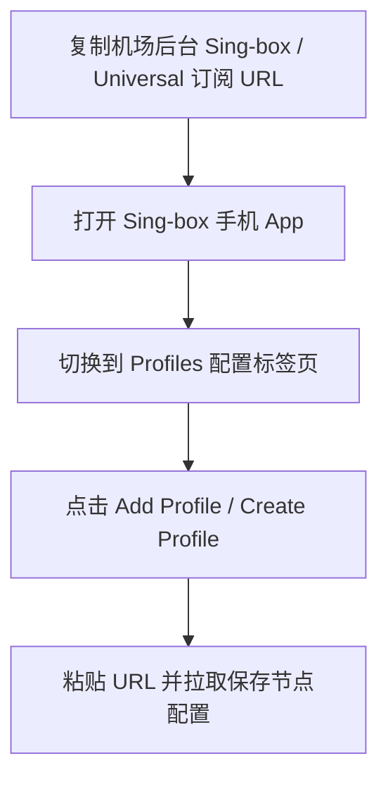

在智能手机端，**Sing-box 移动客户端** 凭藉其**比传统代理应用节省高达 40% 的手机电量、内存占用极低**以及原生支持 Hysteria 2 / VLESS Reality 等优点，正在成为无数极客用户的手机必备软件。

本文将针对 iOS 和 Android 两大系统，为你带来零基础移动端极速上手指南。

---

## iOS 与 Android 双端下载获取方式

在开始配置前，请从官方正规渠道获取手机应用：

| 手机系统平台 | 软件下载渠道 | 费用与说明 |
| :--- | :--- | :--- |
| **iPhone / iPad (iOS)** | 海外区 App Store 搜索 **Sing-box** | 免费下载 (需美区/港区 Apple ID) |
| **Android (安卓系统)** | [GitHub Releases](https://github.com/SagerNet/sing-box) 或 Google Play | 开源免费，提供 .apk 原生安装包 |

---

## 步骤一：向移动端导入机场订阅 Profile

1. 在手机浏览器中登录机场后台，复制专属的 **Sing-box 订阅链接**。
2. 打开 Sing-box App，点击底栏的 **“Profiles” (配置)**。
3. 点击右上角的 **+** 按钮：
   - **Name (名称)**：任意输入机场名称。
   - **Type (类型)**：选择 **Remote (远程订阅)**。
   - **URL**：粘贴复制好的订阅链接。
4. 点击右上角的 **Create / Save** 按钮，应用会自动下载并解析配置文件。

---

## 步骤二：开启 TUN VPN 权限并启动连接

1. 切换回 App 首页的 **“Dashboard” (控制台)** 标签页。
2. 在 Profile 下拉菜单中，选择刚下载好的配置文件。
3. 点击主界面的 **“Enable” (启动开关)**。
4. **系统授权提示**：
   - **iOS 用户**：系统会弹窗要求添加 VPN 配置，点击“允许”并输入 iPhone 锁屏密码。
   - **Android 用户**：系统提示“Sing-box 申请建立 VPN 连接”，点击“确定”。

---

## 移动端省电与后台保活设置

为防止 Sing-box 在手机后台被安卓系统杀掉或导致耗电异常：
- **安卓系统设置**：在手机【设置 -> 应用管理 -> Sing-box】中，将电池优化改为 **“无限制/允许后台运行”**，并开启“自启动”权限。
- **iOS 系统设置**：在【设置 -> Sing-box】中保持 **“后台 App 刷新”** 开启即可。

---

## Sing-box 移动端常见问题 (FAQ)

### Q1：为什么在 Sing-box 手机界面看不到手动切换节点的按钮？
由于 Sing-box 官方原版 App 界面极其精简，默认按照配置文件预设的自动选路模式运行。如果需要手动点选节点，建议导入支持 Selector 手动选择组的高级 JSON 订阅。

### Q2：手机连接科学上网后，微信图片接收变慢怎么办？
请检查你的路由配置是否开启了国内流量直连 (GEOIP CN -> DIRECT)。只要国内流量走直连，微信和本地应用速度就不会受到任何影响。

---

## Sing-box 移动端使用总结

Sing-box 移动端完美解决了科学上网工具在手机上发热严重与耗电快的痛点。只需简单导入订阅并开启 VPN 授权，就能在手机上享受安全稳定、无感智能分流的网络体验。