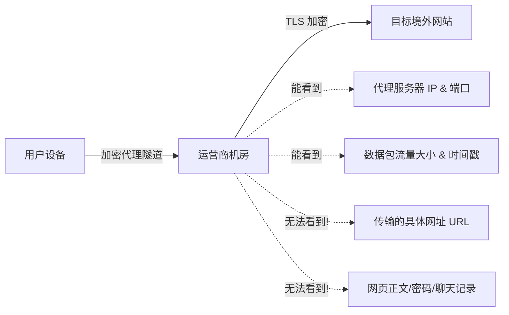

许多用户在翻墙上网时最担心的安全问题就是：**中国电信、联通、移动等运营商知道我在看什么网站吗？我的真实 IP 和个人身份会被泄露或追踪吗？**

本文将从技术原理层面详细拆解 ISP 运营商的监测手段，分析潜在的隐私泄露风险，并提供一套行之有效的安全防护措施。

---

## 运营商 (ISP) 究竟能看到你做过的哪些事？

网络流量在离开你的电脑或手机后，必须经过运营商的机房路由器。运营商视角下的数据可见度如下：

### 1. 运营商能看到的透明数据：
- **连接的服务器 IP 地址**：运营商知道你正在与海外某个特定的 IP 地址保持连接。
- **传输流量的时间与数据量**：例如在某段时间内产生了 2GB 的加密数据传输。
- **未加密的 DNS 查询请求**：如果你没有配置加密 DNS，运营商能看到你查询过哪些域名。

### 2. 运营商绝对看不起的数据（前提是使用了加密代理）：
- **具体的网页内容与请求 URL**：如你在 YouTube 搜索了什么关键字，或者在哪个网页停留。
- **账号密码与敏感数据**：代理协议（Shadowsocks, Vless, Trojan）配合 HTTPS 加密，传输数据对中间节点完全呈现乱码状态。

---

## 造成个人隐私泄露的四大危险隐患

虽然代理协议本身是安全的，但以下不当设置会导致隐私突破防线：

### 隐患一：DNS 域名查询泄露 (DNS Leak)
当你访问 google.com 时，如果客户端没有将 DNS 请求封装到代理隧道中，而是直接向国内运营商的 DNS 服务器 (如 114.114.114.114) 发起查询，运营商便会明文记录你的域名访问历史。

### 隐患二：浏览器指纹与 Cookie 关联 (Browser Fingerprinting)
如果在同一个浏览器中，你既登录了国内绑定实名手机号的微博/知乎账号，又在未开启无痕模式的情况下访问国外敏感论坛，网站广告追踪脚本可以通过 Cookie 和 Cookie 标识符将两个身份进行关联。

### 隐患三：使用不安全的免费机场或第三方翻墙软件
一些来源不明的免费 VPN 应用，其后台可能会记录用户的访问日志 (No-Logs 承诺失效)，甚至在软件中植入恶意代码、窃取浏览器保存的账号密码。

---

## 防范隐私泄露与防关联的实操清单

### 1. 开启客户端的 DNS 防泄露设置
在 Clash Verge、Shadowrocket 或 Sing-box 中，务必开启 **“Fake-IP”** 或 **“Tun 模式”**，并将远程 DNS 替换为安全的 DoH/DoT 加密服务（如 Cloudflare `1.1.1.1` 或 Google `8.8.8.8`）。

### 2. 实行浏览器物理隔离策略
建议使用不同的浏览器区分国内与国外业务：
- **国内日常浏览**：使用 Edge 或 Chrome。
- **海外科学上网**：使用 **Brave 浏览器** 或 Chrome 的独立“隐私配置方案” (Profile)，并开启 Strict 隐私追踪保护。

### 3. 禁止在海外账号中使用国内常用手机号与邮箱
注册 Twitter、Telegram、Discord 等海外平台时：
- 避免使用国内 qq.com / 163.com 邮箱。
- 避免在开放个人资料中暴露国内手机号或相同的用户名 ID。

---

## 运营商监测与隐私常见问题 (FAQ)

### Q1：使用 HTTPS 网站，运营商还会知道我访问了什么吗？
运营商无法知道你在 HTTPS 网站上浏览了什么具体页面或输入了什么内容，但如果不使用科学上网代理，运营商可以通过 **SNI (Server Name Indication)** 明文看到你连接的主机域名。

### Q2：使用 IPLC 专线比公网代理更安全吗？
是的。IPLC 属于物理内网传输，数据包在通过中国边境时不经过公网海缆 gateway，防监测和隐私保护能力显著高于普通公网中转节点。

---

## 隐私安全防范总结

科学上网过程中，只要使用了标准的加密代理协议（如 VLESS-REALITY、Shadowsocks），运营商便**无法窃听你传输的具体内容**。最大隐私风险往往来自于 DNS 明文泄露和个人上网习惯中的身份关联。遵守物理隔离原则与配置加密 DNS，即可保障极致的网络安全。