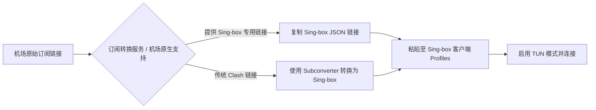

随着 Clash 项目库的停止维护，**Sing-box** 作为基于 Go 语言打造的新一代网络代理通用内核，凭藉其**极低的内存占用、出色的并发性能以及对 Hysteria 2 / TUIC v5 / VLESS Reality 等最新协议的原生支持**，正迅速成为全平台代理客户端的新标准。

本文将为你系统梳理 Sing-box 在多平台上的客户端选择、JSON 订阅转换与极速配置指南。

---

## 为什么 Sing-box 被誉为下一代代理神器？

与传统代理工具相比，Sing-box 拥有显著的技术优势：

1. **原生支持现代先进协议**：无需额外挂载外部二进制内核，直接集成 VLESS Reality、Hysteria 2、TUIC v5 与 Shadowsocks 2022。
2. **极致轻量与内存控制**：运行内存占用仅为 Clash 的 1/3 左右，在路由器或低配 Android 电视盒子上表现尤为亮眼。
3. **统一的规则与配置语法**：采用结构化的 JSON 配置文件格式，实现了 iOS、macOS、Android、Windows 与 Linux 的一套配置跨端通用。

---

## Sing-box 全平台客户端一览表

| 运行平台 | 推荐客户端应用名称 | 软件性质 | 适用特点 |
| :--- | :--- | :--- | :--- |
| **iOS / iPadOS** | **Sing-box App** / **SFM** | App Store (免费/部分区) | 界面简洁，原生内核，内存占用极低 |
| **Android** | **Sing-box for Android** | 开源免费 (GitHub / Google Play) | 支持 TUN 模式全局代理，耗电极低 |
| **Windows / macOS** | **GUI.for.Sing-Box** / **Sing-Box Launcher** | 开源免费 | 图形化操作界面，支持可控的节点分组 |

---

## 核心配置流程：导入与转换 Sing-box 订阅

由于 Sing-box 使用独特的 JSON 配置格式，传统 Clash/Shadowrocket 订阅链接需要通过转换才能在 Sing-box 中使用：

### 1. 使用机场提供的原生 Sing-box 订阅
许多主流机场后台已直接提供 **“一键导入 Sing-box”** 或 **“Sing-box 订阅链接”**。在机场后台选择该选项即可获得直接兼容的配置。

### 2. 通过在线工具进行订阅转换
如果机场未提供原生 Sing-box 格式：
- 打开公信力高的第三方订阅转换平台。
- 粘贴你的原机场订阅 URL。
- 在“生成客户端”下拉菜单中选择 **Sing-box**。
- 复制生成的转换链接。

---

## 客户端实操：以 Android / Windows 为例配置 Sing-box

1. **下载安装客户端**：从官方发布渠道获取最新版本的 Sing-box 图形界面程序。
2. **添加配置 Profiles**：
   - 打开应用，进入 ** Profiles (配置)** 页面。
   - 点击 **Add Profile (添加配置)**。
   - 类型选择 **Remote (远程配置)**。
   - 在 URL 栏中粘贴你的 Sing-box JSON 订阅链接。
   - 设置 Auto-Update（自动更新）间隔为 24 小时，保存并下载配置。
3. **开启代理服务**：
   - 返回 Dashboard 主界面，选择刚下载好的配置文件。
   - 开启 **TUN 模式**（透明代理模式），以获得系统全局的分流加速体验。
   - 点击启动开关，首次运行同意系统 VPN 权限建立请求。

---

## Sing-box 跨平台配置 FAQ

### Q1：Sing-box 和 Clash Verge Rev 有什么区别？
Clash Verge Rev 主要使用 Clash Meta (Mihomo) 内核，图形界面丰富、操作直观；而 Sing-box 是全新的内核架构，性能更高、协议更新速度极快，适合追求性能与最新协议的用户。

### Q2：为什么导入 Sing-box 后无法选择单独的节点？
某些简单的 Sing-box 配置文件默认开启了自动选择（URL Test）最优节点组，没有开启 Selector 节点手动选择。使用功能完善的第三方图形客户端（如 GUI.for.Sing-Box）即可调出手动节点切换列表。

---

## Sing-box 配置指南总结

Sing-box 代表了未来科学上网工具的发展方向。通过掌握 Sing-box 跨平台订阅配置，你可以在 iOS、安卓和电脑端享受极致流畅、低延迟且支持最新加密协议的网络体验。