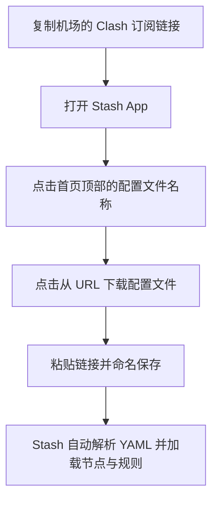

对于习惯使用 Clash 配置规则的用户来说，在苹果 iOS 与 macOS 平台上，**Stash** 被公认为“iOS 端的 Clash 标准替代品”。它完美原生兼容 Clash 的 YAML 配置文件，拥有高颜值的 UI 界面与丰富的自定义面板。

本文将手把手带你完成 Stash 在苹果双端（iOS 与 Mac）的安装配置与高级使用技巧。

---

## 为什么选择 Stash？

1. **100% 兼容 Clash 规则语法**：你可以直接将电脑上的 Clash .yaml 订阅链接原封不动导入 Stash，无需经过复杂繁琐的订阅转换。
2. **精美的仪表盘与面板 (Overview & Dashboard)**：支持在主界面直接查看实时网速、流量统计、节点延迟图表及网页版控制台。
3. **高级脚本扩展 (Stash Script & Rewrite)**：支持 JavaScript 脚本重写、MITM HTTP(S) 解密，功能强大媲美 Quantumult X 和 Surge。

---

## 步骤一：获取并安装 Stash

Stash 是一款付费应用，在非中国大陆区 App Store（美区、港区等）提供下载：
- **iOS / iPadOS 版**：售价约 **$3.99 美元**。
- **macOS 版**：购买 iOS 版后，可在运行 M 芯片 (Apple Silicon) 或 Intel 的 Mac 上使用 Catalyst 版本，或购买 Mac 独立许可。

---

## 步骤二：在 Stash 中导入 Clash 订阅链接

Stash 导入配置的过程非常直观：

1. 在机场后台复制 **Clash 订阅链接**。
2. 打开 Stash App，点击首页顶部当前的配置文件名称（如 Default.yaml）。
3. 点击右上角的 **+** 号，选择 **“从 URL 下载” (Download from URL)**。
4. 粘贴 Clash 订阅 URL，并输入备注名称，点击下载。
5. 下载成功后，在列表中选中该配置文件，使其右侧出现勾选标志。

---

## 步骤三：启动代理与选择节点

1. 返回 Stash 首页，选择所需的路由策略模式：
   - **Rule (规则模式)** **[推荐]**：智能分流国内与海外流量。
   - **Global (全局模式)**：所有流量通过选定节点。
   - **Direct (直连模式)**：绕过代理。
2. 点击 **“控制台” (Policy)** 标签页，在展开的节点分组中选择你心仪的节点。
3. 点击首页右上角的 **“启动” (Start)** 开关。首次连接时根据 iOS 系统提示输入数字密码授予 VPN 权限。

---

## Stash 高级特性功能对比

| 功能模块 | 功能简述 | 实用场景 |
| :--- | :--- | :--- |
| **Web Dashboard** | 开启网页控制台，用电脑浏览器管理手机 Stash | 在大屏电脑上批量测试节点与监控流量 |
| **Override 覆写** | 在不破坏机场原配置的前提下，追加自定义本地规则 | 强制修正特定域名走直连或指定节点 |
| **On-Demand 随需应变** | 根据当前 Wi-Fi 名称自动决定开启或关闭代理 | 连接公司 Wi-Fi 时自动关闭代理，回家自动开启 |

---

## Stash 新手使用常见问题 (FAQ)

### Q1：Stash 和 Shadowrocket (小火箭) 相比哪个更好？
- **小火箭**：上手门槛极低，价格便宜 ($2.99)，适合追求简单快速连接的新手。
- **Stash**：完美继承 Clash 的 YAML 生态，界面美观度与控制台功能更胜一筹，适合 Clash 资深玩家。

### Q2：导入 Clash 订阅后提示 YAML 语法错误怎么办？
通常是因为订阅链接中包含了不兼容的特殊字符或机场后台返回了错误页面。尝试先在浏览器中打开订阅 URL 确认是否有响应，或在 Stash 中选择“允许不安全连接”重新下载。

---

## Stash 快速上手总结

Stash 作为苹果生态下优质的代理客户端，完美弥补了 Clash 没有官方 iOS 应用的遗憾。只需将 Clash 订阅链接直接导入，就能同时在 iPhone 和 Mac 上获得无缝、稳定的智能分流体验。