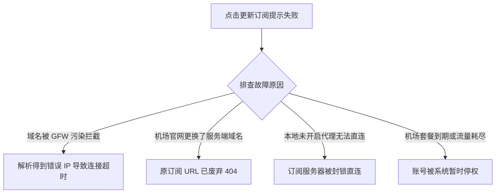

在科学上网过程中，最让人焦虑的莫过于在客户端点击“更新订阅”时，软件弹出一红串报错：**Network Error、404 Not Found 或 Download Configuration Failed**。

没有最新的订阅配置，就无法获取机场维修后的最新节点。本文为你整理了一套系统的**订阅更新失败故障排查与修复流程**。

---

## 订阅更新失败的五大常见根因



---

## 5 步递进式排查与修复方案

### 第一步：开启“已有节点”后再尝试更新（借梯更新）
许多机场的订阅域名已经被运营商进行了 SNI / DNS 污染，在不开启科学上网的情况下，手机和电脑无法直接连接到订阅服务器。
- **操作技巧**：先在客户端中选中一个目前还能勉强使用的旧节点，开启代理后，再次点击“更新订阅”。

---

### 第二步：登录机场后台获取最新的“备用订阅域名”
面对墙的封锁，优质机场会提供多组防封锁订阅域名（如主域名、备用域名及订阅转换专用域名）：
1. 在手机或电脑浏览器中登录机场后台。
2. 检查首页公告，查看是否有域名变更通知。
3. 点击“重新复制订阅链接”，选择 **“备用订阅地址”** 并导入客户端。

---

### 第三步：使用第三方公信力“订阅转换服务”
如果机场原原生订阅链接解析异常，你可以通过订阅转换平台将其重新封装：

```
转换流程：
机场原始订阅 URL -> 粘贴至 Subconverter 订阅转换平台 -> 转换为 Clash / Sing-box / Shadowrocket 格式 -> 生成新的稳定订阅 URL
```

> **安全提示：** 使用第三方订阅转换时，建议优先选择开源且不记录日志的知名后端服务，避免订阅链接泄露。

---

## 订阅报错代码与解决措施一览表

| 报错提示 | 根本原因分析 | 修复解决办法 |
| :--- | :--- | :--- |
| **Network Error / Timeout** | 本地网络无法直连订阅服务器 IP | 先连接已有节点开启代理，或切换为手机热点重试 |
| **404 Not Found** | 机场已废弃该订阅路径或域名 | 登录机场官网后台重新复制最新生成的订阅 URL |
| **Unauthorized / 403** | 机场套餐已过期或流量已耗尽 | 登录后台检查账户余额并续费套餐 |
| **Invalid Certificate** | 订阅域名 SSL 证书过期或本地时间不对 | 校准手机系统时间，或在客户端勾选“允许不安全连接” |

---

## 订阅更新故障排查 FAQ

### Q1：为什么更新订阅成功了，但节点数量反而变少了？
这是正常现象。当机场运维人员下线了故障维护的节点或删除了废弃线路时，更新订阅会自动清理掉本地列表中的失效配置，保持节点列表精简。

### Q2：能否将订阅文件直接下载到本地文件保存？
可以。在浏览器中打开你的订阅 URL，将弹出的文本内容保存为 .yaml 或 .json 本地文件。在 Clash 或 Sing-box 中选择“导入本地配置文件”即可，这种方式完全不受网络环境影响。

---

## 机场订阅更新排查总结

遇到订阅更新失败时，按照 **“开启已有代理更新 -> 登录后台重新复制备用链接 -> 使用订阅转换或下载本地文件”** 的顺序尝试，即可保证你的客户端永远能够稳定拉取最新节点。