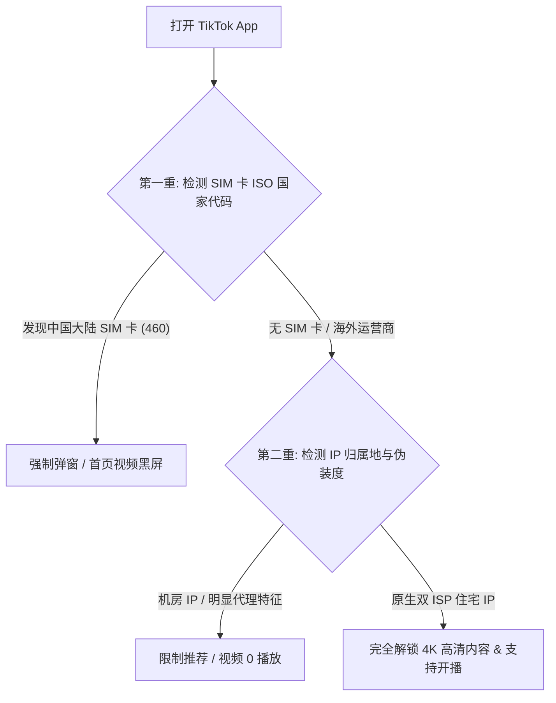

作为全球最火爆的短视频平台，**TikTok (海外版抖音)** 针对中国大陆用户设置了极强的风控屏障：它不仅检测用户的 IP 地址，还会主动读取手机内部插入的 **SIM 卡 MCC/MNC 运营商代码**。一旦检测到国内运营商（中国电信/联通/移动）SIM 卡，应用便会直接**黑屏或提示“No Internet Connection”**。

本文为你提供 iOS 与 Android 全平台**免拔卡、免刷机**观看与运营 TikTok 的完整解决方案。

---

## TikTok 区域风控检测机制拆解



---

## 解决方案一：iOS (iPhone) 免拔卡破解方案 (Shadowrocket / Stash)

在 iPhone 上，无需拔掉手机卡，利用小火箭或 Stash 的 **HTTPS 重写 (Rewrite & MITM)** 功能即可绕过 SIM 卡检测：

### 1. 开启 MITM 并信任 CA 证书
- 打开 Shadowrocket 【配置 -> HTTPS 解密】，生成并安装 CA 证书，在 iPhone【设置 -> 通用 -> 关于本机 -> 证书信任设置】中开启完全信任。

### 2. 添加 TikTok 换区重写规则
在小火箭配置的 URL 重写中添加以下两条核心规则（以将 TikTok 伪装为日本区为例）：

```
规则路径：
(?<=&mcc_mnc=)46000 310260 302
(?<=&app_version=)[0-9]+\.[0-9]+ 100.0.0 302
```

- 将 MCC 码 460（中国）动态重写替换为 310（美国）或 440（日本）。
- 保存规则后，连接一个日本或美国原生节点，打开 TikTok 即可刷出当地短视频。

---

## 解决方案二：Android (安卓) 免拔卡破解方案 (Mod 修正版 App)

安卓手机上观看 TikTok 最简单、最稳定的方法是直接安装社区开源的 **TikTok Mod (修改版)**：

1. **下载 Mod 安装包**：从公信力高的开源社区获取内置插件的 TikTok Mod APK。
2. **配合 TikTok Plugin 插件**：
   - 随应用安装 **TikTok Plugin** 辅助插件。
   - 打开 Plugin 插件，在“Region”下拉菜单中自由切换你想要去的国家（如美国、日本、韩国、英国）。
   - 勾选“Remove Watermark”（去除视频水印）与“Bypass SIM Guard”（绕过 SIM 卡检测）。
3. 打开 TikTok 即可直接使用微信/邮箱注册或登录账号，流畅刷视频。

---

## 运营级玩家进阶：选择原生双 ISP 住宅 IP

如果你不仅仅是为了看视频，而是为了进行 **TikTok 跨境电商带货、直播或账号运营**：

| 节点 IP 类型 | 账号安全等级 | 视频播放量表现 | 是否适合直播带货 |
| :--- | :--- | :--- | :--- |
| **普通机房 IP** | 极低 (易被判定为机器人) | 频繁出现 0 播放 (0 views) | 严禁使用 (秒封号) |
| **原生双 ISP 住宅 IP** | **顶级 (完全模拟真实居民)** | 正常进入流量推荐池 | **强烈推荐 (极度稳定)** |

---

## TikTok 免拔卡换区 FAQ

### Q1：为什么成功打开了 TikTok，但发视频总是 0 播放？
0 播放通常是因为你使用的代理节点 IP 已经被 TikTok 系统标记为数据中心机房 IP，或者你的手机时区、语言没有调整为目标国家（例如目标为美国，手机语言需切为英文，时区切为纽约时间）。

### Q2：使用 Mod 修改版 TikTok 会导致个人账号被封吗？
仅用于观看短视频风险极低；若涉及账号资金变现或大量发视频，建议使用苹果正版 App Store 下载的 TikTok，配合小火箭重写脚本与原生住宅 IP 节点使用。

---

## TikTok 换区免拔卡总结

破解 TikTok 的关键在于**通过脚本重写绕过 SIM 卡 460 代码检测**，并配合**纯净的原生海外节点 IP**。按照本文的方案配置后，你无需拔卡就能轻松解锁全球精选短视频。