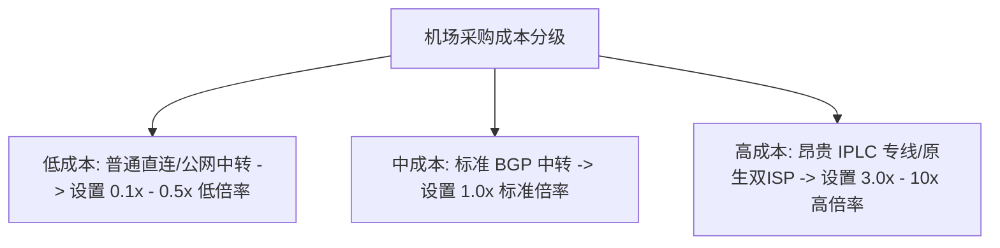

使用科学上网机场时，在客户端的节点列表中，我们常会看到节点名称前带有 **[0.1x]、[1.0x]、[3.0x] 甚至 [10x]** 的后缀标识。

这些**节点倍率**究竟是什么意思？为什么看同样一个 1GB 的视频，有些节点只扣 100MB 流量，而有些节点却扣了 5GB？本文为你详细揭秘机场倍率计算机制与避坑策略。

---

## 什么是节点倍率？(Node Multiplier)

**节点倍率**是机场服务商用于调节不同节点使用成本与流量消耗的计费杠杆。

```
真实扣除套餐流量 = 实际消耗的网络流量 × 节点倍率系数
```

### 简单换算举例（假设你实际下载了 1GB 数据）：
- 使用 **0.1x 低倍率节点**：扣除流量 = 1GB × 0.1 = **0.1GB (100MB)**
- 使用 **1.0x 标准倍率节点**：扣除流量 = 1GB × 1.0 = **1.0GB (1000MB)**
- 使用 **5.0x 高倍率专线节点**：扣除流量 = 1GB × 5.0 = **5.0GB (5000MB)**

---

## 为什么机场要设置不同的节点倍率？

不同倍率节点的背后，对应着机场购买的**服务器与带宽线路成本差异**：



1. **倾斜与平衡带宽负载**：机场希望引导大流量下载用户去使用闲置的廉价低倍率节点，把宝贵的高昂专线带宽留给需要低延迟的用户。
2. **覆盖高成本专线费用**：IPLC/IEPL 专线带宽单价极高，若按 1.0x 计费机场会严重亏损，因此必须通过 3x~5x 高倍率回收成本。

---

## 不同倍率节点的适用场景对比

| 倍率分类 | 典型倍率范围 | 线路质量特征 | 最佳适用场景 |
| :--- | :--- | :--- | :--- |
| **低倍率节点** | 0.1x - 0.5x | 公网直连/大带宽公网，晚高峰可能有微卡 | 百度网盘/Steam 游戏大文件下载、系统更新 |
| **标准倍率节点**| 1.0x | 优质 BGP 中转，性能均衡 | 日常网页浏览、YouTube/Bilibili 视频观看 |
| **高倍率节点** | 3.0x - 10.0x | IPLC 内网物理专线、原生住宅双 ISP IP | 实时电竞游戏、加密货币交易、Netflix 4K |

---

## 防偷扣流量：三大实用避坑指南

### 1. 挂机下载大文件前，务必核对当前节点倍率！
如果你在挂机下载一个 50GB 的游戏安装包，一不小心选中了 5x 倍率节点，你的套餐将会瞬间被扣除 **250GB 流量**，直接导致套餐提前报废！下载大文件请切记手动切换至 0.1x 或 0.2x 节点。

### 2. 警惕某些机场的“高倍率隐蔽标注”
部分不诚信的机场会在列表中将普通节点标为 1x，而将大部分可用节点悄悄改标为 3x 或 5x，变相缩减用户的实际可用流量。购买套餐前请查看节点列表的倍率分布。

### 3. 开启 Clash / Shadowrocket 的流量监测面板
在客户端控制台中随时留意已用流量的变化情况，定期在机场后台核对已用账单。

---

## 节点倍率机制常见问题 (FAQ)

### Q1：0.1x 倍率节点速度一定很慢吗？
不一定。0.1x 仅代表扣费便宜，并不必然代表限速。在白天非高峰期，许多 0.1x 直连节点同样可以跑满几百兆带宽，非常适合大流量下载。

### Q2：使用 5x 倍率节点看视频，画质会比 1x 节点清晰 5 倍吗？
不会。视频画质取决于视频源本身和你的带宽大小。5x 节点提供的是更低的丢包率和极佳的稳定性（不弹圈），而不是改变视频本身分辨率。

---

## 节点倍率避坑总结

理解机场节点倍率机制是合理规划科学上网套餐流量的关键。**“大流量下载选低倍率，重要游戏/交易选高倍率专线，日常浏览用 1.0x 节点”**，掌握这一原则就能彻底避免流量被无故偷扣的尴尬。