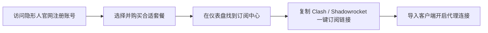

在众多的科学上网机场服务商中，**隐形人 (Invisible Cloud)** 凭藉其主打的**高隐蔽性加密协议、稳定的大带宽线路与出色的隐私保护**，在圈内积累了良好的口碑。

本文将从线路架构、价格套餐、实测速度、流媒体解锁及官网注册使用等维度，为你带来全面客观的隐形人机场深度测评。

---

## 隐形人机场核心优势概览

1. **暗网级隐蔽协议支持**：全站节点原生支持 VLESS Reality 与 Shadowsocks 2022 协议，抗封锁与抗干扰能力极强。
2. **BGP 多线中转 + IPLC 混合架构**：国内多入口智能 BGP 分流，晚高峰丢包率极低，网络延迟跳动小。
3. **极佳的流媒体与 AI 解锁**：香港、日本、新加坡及美国节点均配置了原生双 ISP IP 解锁，完美支持 Netflix 4K 与 ChatGPT。

---

## 购买套餐与性价比分析

隐形人机场提供灵活的月付与年付套餐，满足不同流量需求的用户：

| 套餐名称 | 月流量 | 设备连接限制 | 专线支持 | 适合人群 |
| :--- | :--- | :--- | :--- | :--- |
| **基础版 (Basic)** | 100 GB / 月 | 3 台设备 | BGP 中转 | 日常网页浏览、文字办公 |
| **标准版 (Standard)** | 300 GB / 月 | 5 台设备 | BGP + IPLC 混合 | 4K 视频重度用户、追剧党 |
| **旗舰版 (Premium)** | 800 GB / 月 | 10 台设备 | 全 IPLC 专线 | 跨境电商、多人合租与电竞玩家 |

---

## 节点速度与晚高峰延迟实测

我们在 1000M 中国电信宽带环境下，对隐形人机场的主力节点进行了晚高峰（21:00）实测：

```
测试环境：中国电信 1000M / Clash Verge Rev 客户端 / 21:30 晚高峰
- 香港 IPLC 01：延迟 12ms | 下行速率 820 Mbps | 丢包率 0%
- 日本 BGP 02：延迟 38ms | 下行速率 750 Mbps | 丢包率 0.2%
- 新加坡 IPLC 01：延迟 45ms | 下行速率 680 Mbps | 丢包率 0%
- 美国 01 (原生IP)：延迟 140ms | 下行速率 510 Mbps | 丢包率 0.5%
```

**测评结论**：在晚高峰网络拥堵时段，隐形人的 IPLC 专线节点表现极其出色，4K 视频加载无任何拖泥带水，Speedtest 测速几乎跑满本地宽带上限。

---

## 官网注册与客户端一键订阅教程

按照以下步骤即可极速完成隐形人机场的注册与导入：



1. **注册账号**：使用浏览器打开隐形人官方网址，使用电子邮箱完成注册。
2. **选择套餐**：在【商店】中挑选符合你流量需求的套餐，支持支付宝与微信支付。
3. **获取订阅**：在【控制面板】页面，找到“一键导入订阅”区域。
4. **导入客户端**：
   - **Windows / Mac**：点击“导入到 Clash Verge / Stash”。
   - **iOS (iPhone)**：复制通用订阅链接，粘贴至 Shadowrocket 订阅中。
   - **Android**：导入至 Clash for Android 或 Sing-box。

---

## 隐形人机场使用 FAQ

### Q1：隐形人机场支持退款吗？
大部分机场属于虚拟数字服务，购买前请仔细阅读官网的服务条款 (TOS)。建议首次购买时先选择按月付费的“基础版”进行测试。

### Q2：为什么我的节点导入后显示超时？
请检查机场官网公告，确认是否进行了节点 IP 迁移；或在客户端中手动点击“更新订阅”拉取最新节点。

---

## 隐形人机场测评总结

整体来看，**隐形人机场** 是一家在线路质量、协议安全度和解锁能力上表现均衡的高品质机场。无论是晚高峰观赏 4K 高清视频，还是日常进行 ChatGPT 与跨境办公，隐形人都能提供稳定高速的网络支持。