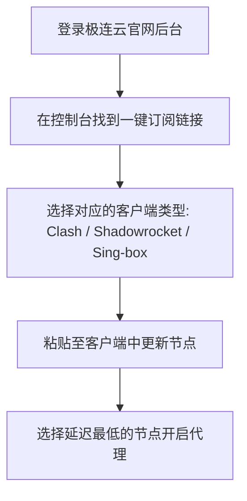

在追求极致性价比的科学上网圈子中，**极连云 (Jilian Cloud)** 凭藉**低至几元钱的入门套餐、丰富的节点数量以及良好的大流量支持**，吸引了大量学生党与大流量下载用户的关注。

本文将针对极连云机场的线路配置、价格方案、实测速度以及软件导入流程进行全面客观的测评。

---

## 极连云机场技术特色

1. **超高性价比套餐设计**：提供按月付费与按量计费（不限时流量包）多种选择，入门门槛极低。
2. **多节点覆盖**：除香港、日本、韩国、新加坡、美国等常用节点外，还提供了英国、德国、澳大利亚等冷门节点。
3. **智能负载均衡中转**：采用分布式 BGP 中转节点，动态分发高峰期用户流量，防止单节点拥堵。

---

## 套餐价格与流量方案对比

极连云的套餐定价十分亲民：

| 套餐类型 | 套餐价格 | 流量额度 | 同时在线设备 | 适用场景 |
| :--- | :--- | :--- | :--- | :--- |
| **体验版 (Mini)** | ¥6.8 / 月 | 150 GB | 2 台 | 学生党日常学习、查阅资料 |
| **进阶版 (Pro)** | ¥15.8 / 月 | 500 GB | 4 台 | 高清视频追剧、多设备共享 |
| **不限时流量包** | ¥39.0 / 一次性 | 300 GB (永不过期) | 5 台 | 备用梯子、大流量临时下载 |

---

## 晚高峰网速与流媒体解锁实测

我们在晚高峰 21:00 对极连云的核心节点进行了实际性能测试：

```
测试结果汇总（宽带：中国联通 500M）：
- 香港 BGP 01：Ping 24ms | 测速 420 Mbps | 解锁 Netflix / Disney+ / ChatGPT
- 日本 02：Ping 48ms | 测速 390 Mbps | 解锁 YouTube Premium / Claude
- 新加坡 01：Ping 55ms | 测速 350 Mbps | 解锁 Shopee / TikTok
- 美国 01：Ping 160ms | 测速 280 Mbps | 解锁 OpenAI / Midjourney
```

**实测评价**：极连云在 1080P/4K 视频播放时表现顺畅，缓冲时间保持在 1 秒以内。虽然极端晚高峰的峰值带宽略逊于昂贵的全 IPLC 专线机场，但考虑到其极为亲民的价格，性价比优势极其突出。

---

## 极连云订阅导入教程



1. **注册登录**：访问极连云官方网站，输入邮箱与密码创建账户。
2. **购买订阅**：进入【商店】，选择符合需求的流量套餐并完成支付。
3. **复制链接**：在【仪表盘】找到订阅地址，点击“复制一键订阅”。
4. **导入客户端**：
   - **Clash Verge Rev**：配置 -> 粘贴 URL -> 下载配置。
   - **Shadowrocket**：添加类型选择 Subscribe -> 粘贴 URL。

---

## 极连云使用常见问题 (FAQ)

### Q1：极连云的不限时流量包划算吗？
非常划算！如果你平时科学上网频率较低，仅作为备用梯子或者临时查资料使用，购买一次性不限时流量包无需每月续费，使用成本更低。

### Q2：极连云节点支持打游戏吗？
极连云的主力节点为 BGP 中转线路，延迟在 20~50ms 左右，对于日常网页游戏、Steam 联机足够使用。若追求极致 0 丢包电竞体验，建议配合专线节点。

---

## 极连云机场测评总结

**极连云 (Jilian Cloud)** 是一款性价比出众的平民级机场。无论是作为主用梯子还是备用流量包，它都能在极低的使用成本下提供令人满意的速度与流媒体解锁体验。