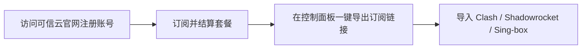

对于需要长期稳定科学上网的跨境电商卖家、远程办公族及外贸企业来说，机场的**稳定性与 SLA (服务等级协议) 在线率**远比单纯的价格便宜更重要。**可信云 (Kexin Cloud)** 正是一家主打“企业级高可靠性”的精品专线机场。

本文将从服务器架构、服务可靠性、节点网速实测及套餐性价比等多个维度，为你详细解读可信云机场的实际表现。

---

## 可信云机场的核心优势

1. **企业级全 IPLC/IEPL 专线保障**：拒绝低质直连，全站节点均采用物理内网专线中转，晚高峰连通率高达 99.9%。
2. **原生双 ISP 独立 IP 支持**：针对亚马逊外贸、TikTok 运营及 ChatGPT 团队，提供高纯净度的原生 IP。
3. **SLA 高可用在线率承诺**：拥有多入口热备冗余机制，即便某一条出口海缆受损，系统也能在秒级内自动切换备用线路。

---

## 可信云套餐价格与服务等级

可信云定位中高端，套餐设计注重服务保障与多设备并发能力：

| 套餐级别 | 价格 | 月流量 | 允许同时在线设备 | 特殊权益 |
| :--- | :--- | :--- | :--- | :--- |
| **标准个人版** | ¥28 / 月 | 200 GB | 4 台设备 | 100% 全专线 + 流媒体解锁 |
| **商务精英版** | ¥58 / 月 | 500 GB | 8 台设备 | 原生双 ISP IP + 专属客服支持 |
| **团队企业版** | ¥128 / 月 | 1200 GB | 20 台设备 | 支持定制专线与高并发大流量 |

---

## 节点速度与晚高峰抗压实测

我们在晚高峰 21:00 - 22:30 网络最拥堵的时段，对可信云进行了一连串严苛的测速与稳定性对比：

```
晚高峰节点参考性能指标（基于千兆宽带与 Clash 客户端环境）：
- 港专线 01 (IPLC)：Ping 9ms | 下行 890 Mbps | 抖动 ±1ms (极稳定)
- 日专线 02 (IEPL)：Ping 32ms | 下行 840 Mbps | 抖动 ±2ms
- 美专线 01 (双ISP)：Ping 135ms | 下行 650 Mbps | 抖动 ±3ms
- 4K 拖拽测试：YouTube 4K 秒开，连接速率稳定保持在 180,000 Kbps 以上
```

**测评结论**：可信云在晚高峰期间毫无丢包现象，网络抖动极低，表现出了高端企业级专线应有的卓越稳定性。

---

## 官网注册与配置导入流程

在可信云官网完成配置仅需三步：



1. **创建账号**：使用常用电子邮箱注册可信云官方账号。
2. **选择适合套餐**：根据你的团队人数或流量消耗选购套餐。
3. **导入客户端**：
   - 打开控制面板，在“订阅管理”中复制专属 Clash / Stash / Shadowrocket 链接。
   - 打开客户端选择“导入订阅”，刷新节点列表后开启全局配置模式。

---

## 可信云企业服务 FAQ

### Q1：可信云适合用来做跨境电商店铺运营吗？
非常适合。可信云提供纯净的原生双 ISP 住宅 IP 节点，能有效规避亚马逊、eBay 等平台因机房 IP 关联导致的封店风险。

### Q2：为什么可信云的价格比普通机场偏贵？
因为可信云投入了大量成本在全 IPLC 物理专线租用与多入口冗余架构上，用高成本换取了晚高峰 0 丢包和 99.9% 的连通率。

---

## 可信云专线测评总结

**可信云 (Kexin Cloud)** 是一款追求极致稳定性与高品质服务的专线机场。如果你厌倦了廉价机场频繁节点超时、晚高峰卡顿等困扰，可信云绝对是保障高效工作与优质娱乐的不二之选。