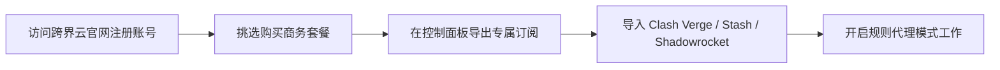

对于从事亚马逊、Shopee、TikTok 跨境电商运营、外贸接单以及海外远程工作的团队来说，网络连接的** IP 纯净度与专线稳定性**直接关系到店铺账号的安全。**跨界云 (Kuajie Cloud)** 正是一面主打“跨境商务与高品质专线”的服务商。

本文将从线路技术架构、套餐方案、实测速度与注册使用等方面，为你带来跨界云机场的全面测评。

---

## 跨界云机场核心技术优势

1. **独家提供静态原生双 ISP 住宅 IP**：为跨境电商卖家提供防关联、防封店的纯净本土住宅 IP，有效降低风控风险。
2. **企业级 IPLC 内网点对点物理专线**：跨国段数据传输不走公网防火墙，晚高峰丢包率小于 0.1%，保障跨境办公无缝衔接。
3. **支持多设备高并发连接**：套餐设计支持团队多台电脑与手机同时在线，非常适合工作室与合租用户。

---

## 跨界云套餐价格与服务定位

跨界云针对个人用户与企业团队推出了定制化套餐：

| 套餐级别 | 价格 | 月流量 | 允许同时在线设备 | 适用业务场景 |
| :--- | :--- | :--- | :--- | :--- |
| **个人商务版** | ¥25 / 月 | 200 GB | 4 台设备 | 个人外贸接单、海外学术科研 |
| **卖家进阶版** | ¥55 / 月 | 500 GB | 8 台设备 | 亚马逊/Shopee 店铺运营、TikTok |
| **企业工作室版**| ¥118 / 月 | 1200 GB | 20 台设备 | 团队多人办公、独立站后台管理 |

---

## 跨界云晚高峰商务专线实测

我们在晚高峰 21:00 对跨界云的商务专线节点进行了综合实测：

```
测试结果（中国电信 1000M / 专线节点）：
- 香港静态专线 01：Ping 11ms | 测速 850 Mbps | 丢包 0% | IP 属性：HKT 本土运营商
- 美西电商专线 01：Ping 132ms | 测速 620 Mbps | 丢包 0% | IP 属性：AT&T 住宅 IP
- 亚马逊/TikTok 鉴权测试：无任何代理风险弹窗警告
```

**测评结论**：跨界云在晚高峰期间连通性极佳，传输速率高，且节点 IP 的 ASN 属性完全为海外本土 ISP 运营商，纯净度极高。

---

## 跨界云官网注册与订阅导入



1. **注册账户**：访问跨界云官方网站，输入邮箱完成账号创建。
2. **选择套餐**：根据你的团队规模与业务需求选购套餐。
3. **获取订阅**：在【控制面板】点击“一键导入订阅”，复制专属链接。
4. **导入运行**：在客户端中导入配置，选中商务专线节点即可顺畅办公。

---

## 跨界云商务专线 FAQ

### Q1：跨界云的 IP 会和其他卖家产生关联吗？
跨界云的“静态住宅 IP”为独享或低并发隔离组，比起传统便宜机场成百上千人挤在同一个机房 IP 上，防关联安全性有量级的提升。

### Q2：跨界云适合看 4K 视频或打游戏吗？
完全适合。跨界云底层基于 IPLC 物理专线构建，带宽上限极高，不仅能保障商务办公，看 YouTube 4K 或进行跨国游戏同样非常顺畅。

---

## 跨界云机场测评总结

**跨界云 (Kuajie Cloud)** 是一面专业度极高、主打安全与稳定的中高端商务专线机场。如果你有跨境电商店铺管理、外贸沟通或海外远程工作的硬性需求，跨界云能为你提供极具安全感网络支撑。