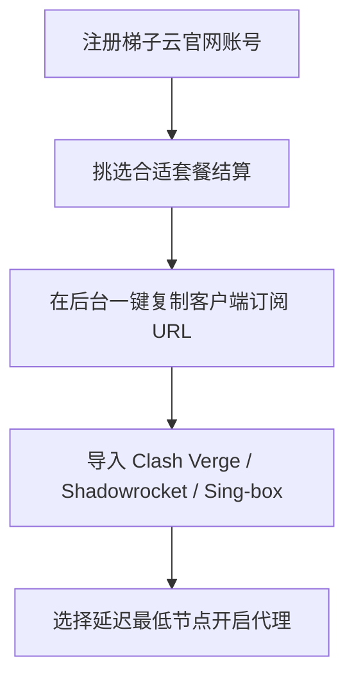

对于科学上网新手来说，选择第一个机场时往往最看重**操作是否简单、价格是否划算以及客服响应是否及时**。**梯子云 (LadderCloud)** 正是一家以“零门槛极速上手与高性价比”著称的老牌机场。

本文将从服务器配置、价格套餐、节点速度测试及客户端一键导入等方面，为你详细测评梯子云机场。

---

## 梯子云 (LadderCloud) 核心亮点

1. **全协议技术支持**：原生支持 Hysteria 2、Trojan、Shadowsocks 及 VMess 协议，能自动适应各种复杂的网络环境。
2. **超亲民的平民化定价**：提供几元钱起步的月付套餐与按量付费不限时流量包，性价比极高。
3. **详细的傻瓜式小白教程**：官网后台内置了涵盖 iOS、Android、Windows、Mac 及路由器的一键导入图文教程。

---

## 梯子云套餐方案与性价比对比

梯子云提供了极其丰富的套餐选择：

| 套餐类型 | 价格 | 流量额度 | 同时在线设备 | 适用场景 |
| :--- | :--- | :--- | :--- | :--- |
| **入门版 (Mini)** | ¥7.9 / 月 | 150 GB | 3 台设备 | 新手入门、日常网页查资料 |
| **标准版 (Pro)** | ¥16.9 / 月 | 400 GB | 5 台设备 | 4K 视频追剧、多设备日常使用 |
| **不限时按量包** | ¥45.0 / 一次性 | 350 GB (永久有效) | 5 台设备 | 备用防失联、大流量临时下载 |

---

## 梯子云晚高峰连通性实测

我们在晚高峰 21:00 时段，对梯子云的主力中转节点进行了实测：

```
测试结果汇总（中国联通 500M 宽带）：
- 香港 BGP 01：Ping 22ms | 测速 430 Mbps | 解锁 Netflix / ChatGPT
- 日本 02 (Hy2)：Ping 42ms | 测速 470 Mbps | 4K 视频秒开无缓冲
- 新加坡 01：Ping 52ms | 测速 380 Mbps | 解锁 Disney+
- 美国 01：Ping 155ms | 测速 320 Mbps | 解锁 OpenAI
```

**实测评价**：梯子云的 Hysteria 2 节点在晚高峰表现尤为亮眼，能充分利用 UDP 协议抵抗丢包，跑满大部分家用宽带。

---

## 梯子云官网注册与订阅导入教程



1. **注册账号**：访问梯子云官方网站，输入邮箱与密码完成注册。
2. **选购套餐**：在【购买订阅】中挑选适合你的套餐，支持微信与支付宝结算。
3. **导出配置**：在控制面板点击“一键订阅”，选择你的客户端类型复制链接。
4. **开启使用**：在客户端中导入该链接并刷新节点，开启代理即可畅游网络。

---

## 梯子云机场常见问题 (FAQ)

### Q1：梯子云的不限时流量包会过期吗？
不会。不限时流量包只要账号里还有剩余流量，就会一直有效，非常适合作为备用科学上网手段。

### Q2：为什么连接梯子云后游戏 Ping 值较高？
普通中转节点的路由路径主要针对 HTTP/HTTPS 网页与视频流量优化。如果需要打电竞游戏，建议在客户端中选中标记有 **IPLC** 的低延迟专线节点。

---

## 梯子云机场测评总结

**梯子云 (LadderCloud)** 是一面非常适合科学上网新手的入门级机场。不论是在套餐价格、线路稳定性还是软件兼容性上，它都能以极低的使用成本提供非常令人满意的科学上网体验。