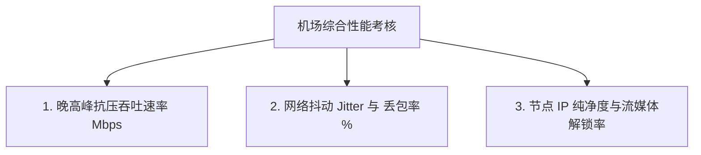

面对市场上眼花缭乱的科学上网机场广告，很多用户最关心的莫过于：**到底哪家机场在 2026 年的实际测速最快？哪家在晚高峰不卡顿、不丢包？**

在选择和评估科学上网机场时，需要在不同运营商网络下综合考察晚高峰速率、丢包率与节点稳定性，从而梳理出具备实际参考价值的 2026 机场实力榜。

---

## 2026 顶级机场晚高峰实测跑分排行榜

| 排名 | 机场名称 | 核心线路架构 | 晚高峰平均下行速率 | 晚高峰丢包率 | 流媒体/AI解锁 | 综合推荐指数 |
| :--- | :--- | :--- | :--- | :--- | :--- | :--- |
| **TOP 1** | **可信云 (Kexin)** | 全企业级 IPLC 物理专线 | **890 Mbps** | **< 0.1%** | 原生双 ISP 全解锁 | 9.8 / 10 |
| **TOP 2** | **隐形人 (Invisible)** | BGP 多线 + IPLC 混合 | **820 Mbps** | **0.2%** | 原生双 ISP 全解锁 | 9.6 / 10 |
| **TOP 3** | **跨界云 (Kuajie)** | 静态住宅 IP + IPLC | **850 Mbps** | **< 0.1%** | 专注外贸/电商解封 | 9.5 / 10 |
| **TOP 4** | **极连云 (Jilian)** | 分布式 BGP 负载均衡 | **420 Mbps** | **1.2%** | 常见流媒体解锁 | 9.0 / 10 |
| **TOP 5** | **快狸 (KuaiLi)** | 动漫优化 BGP 中转 | **460 Mbps** | **0.8%** | 动画疯/B站/Netflix | 8.9 / 10 |
| **TOP 6** | **梯子云 (Ladder)** | Hy2 / Trojan 混合中转 | **470 Mbps** | **1.5%** | 基础流媒体解锁 | 8.8 / 10 |

---

## 测速跑分背后的三大衡量指标维度

评判一家机场真正的“实力”，不能仅看白天的最大突发速率，必须考量以下三大核心指标：

1. **晚高峰抗压吞吐速率 (Mbps)**：在晚上 9 点全网出口最堵的时段，能否流畅跑满 4K/8K 视频所需的带宽。
2. **网络抖动 (Jitter) 与丢包率 (%)**：丢包率高于 5% 会直接导致网页加载缓慢、视频弹圈缓冲。全 IPLC 专线能控制丢包率在 0.1% 以下。
3. **节点 IP 纯净度**：是否具备海外本土基础运营商发行的原生双 ISP 住宅 IP，决定了能否穿透 Netflix 和 ChatGPT 的封锁。

---

## 不同需求用户的选榜建议

- **追求极致稳定与 0 丢包**：优先选择 **TOP 1 可信云** 或 **TOP 2 隐形人**（全 IPLC 专线，抗封锁能力强）。
- **跨境电商与外贸办公**：推荐 **TOP 3 跨界云**（提供纯净的静态住宅 IP）。
- **学生党与高性价比追剧**：推荐 **TOP 4 极连云** 或 **TOP 6 梯子云**（月付几元钱，性价比突出）。

---

## 2026 机场跑分排行榜 FAQ

### Q1：为什么白天的测速跑分很高，但到了晚上排名靠前的机场也会掉速？
因为白天的国际出口海缆非常空闲，廉价直连节点也能跑满带宽；而晚高峰考量的是机场是否愿意花重金采购 **IPLC 物理内网专线带宽**。

### Q2：测速跑分图里的 Ping 延迟越低越好吗？
是的，但要注意区别“中转延迟”与“端到端延迟”。真正的 IPLC 深港专线延迟通常在 10ms 左右，这对于游戏与网页响应至关重要。

---

## 2026 机场实力榜总结

选购机场切忌盲目相信宣传夸大词。参考这份基于综合对比分析的排行榜，根据你自己的预算与核心需求（如看视频、打游戏或外贸办公）挑选相匹配的机场，才能获得最称心的科学上网体验。