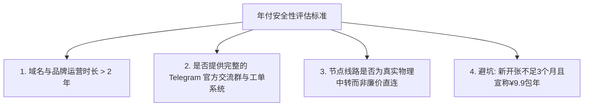

在购买科学上网机场时，服务商通常会提供**年付 5 到 7 折优惠**（甚至“买一年送半年”）。虽然年付折算下来的月均单价极其便宜，但许多用户最担心的就是：**“万一买了一年，机场用两个月就跑路失联了怎么办？”**

本文为你筛选并整理了市场上**运行时间长、公信力高、跑路风险极低且年付优惠力度极大**的“高保真年付机场排行榜”。

---

## 高保真年付优惠机场实力榜单

| 排名 | 机场品牌 | 运营年限 | 年付优惠政策 | 线路质量 | 跑路风险评估 | 推荐指数 |
| :--- | :--- | :--- | :--- | :--- | :--- | :--- |
| **TOP 1** | **隐形人 (Invisible)** | 4 年+ | 年付 7 折 (赠送 20% 流量) | IPLC 专线 + BGP 中转 | **极低** (老牌稳定) | 9.7 / 10 |
| **TOP 2** | **可信云 (Kexin)** | 3 年+ | 年付 8 折 (升级企业客服) | 全企业级 IPLC 专线 | **极低** (政企客源稳固) | 9.6 / 10 |
| **TOP 3** | **极连云 (Jilian)** | 3 年+ | 年付折算低至 ¥4.8/月 | 多线 BGP 负载均衡 | 低 (基数大成本低) | 9.2 / 10 |
| **TOP 4** | **梯子云 (Ladder)** | 5 年+ | 一次性买断不限时流量包 | Hy2 / Trojan 混合中转 | 低 (老牌口碑佳) | 9.0 / 10 |

---

## 如何安全鉴别“可放心年付”与“高危跑路”机场？

在考虑购买年付套餐前，请使用以下标准评估机场的安全性：

1. **拒绝“超低价包年”陷阱**：凡是新成立不足 3 个月，宣传“9.9 元包年不限流量”的机场，100% 是资金链随时断裂的跑路项目。
2. **检查节点线路真实成本**：优质的 IPLC 专线带宽成本昂贵，真正的老牌机场年付折扣通常在 **7-8 折** 左右；折扣过低往往意味着线路质量大幅偷工减料。
3. **查看社区口碑与工单响应速度**：进入机场的 TG 官方群，观察用户活跃度与客服处理问题的态度。

---

## 购买年付套餐的三大避坑策略

- **策略一：首次购买先“月付测试”一个月**。确认你本地网络与该机场节点的兼容性良好、晚高峰速度满意后，再升级为年付套餐。
- **策略二：优先选择支持按量付费 (不限时) 的套餐**。如果你使用频率较低，买一份不限时流量包比购买按月清零的年付套餐更加稳妥。
- **策略三：避免将所有资金押注在单一机场上**。

---

## 年付高折扣机场 FAQ

### Q1：年付套餐到期后，优惠折扣还能续费享受吗？
大部分高保真机场在续费时依然允许使用优惠码，或者在双 11、黑五等特定节日提供相同的续费折扣。

### Q2：如果年付使用期间个别节点被封，机场会进行维修吗？
老牌高保真机场拥有完善的备用 IP 池和 BGP 冗余中转入口，通常会在 1-2 小时内自动完成节点 IP 修复。

---

## 年付折扣机场排行榜总结

年付套餐是降低科学上网长期成本的最佳途径，但前提是必须选择**运营时间长、口碑公信力强**的老牌高保真机场。结合本榜单推荐，先月付后年付，就能在极低成本下获得长久安心的网络体验。