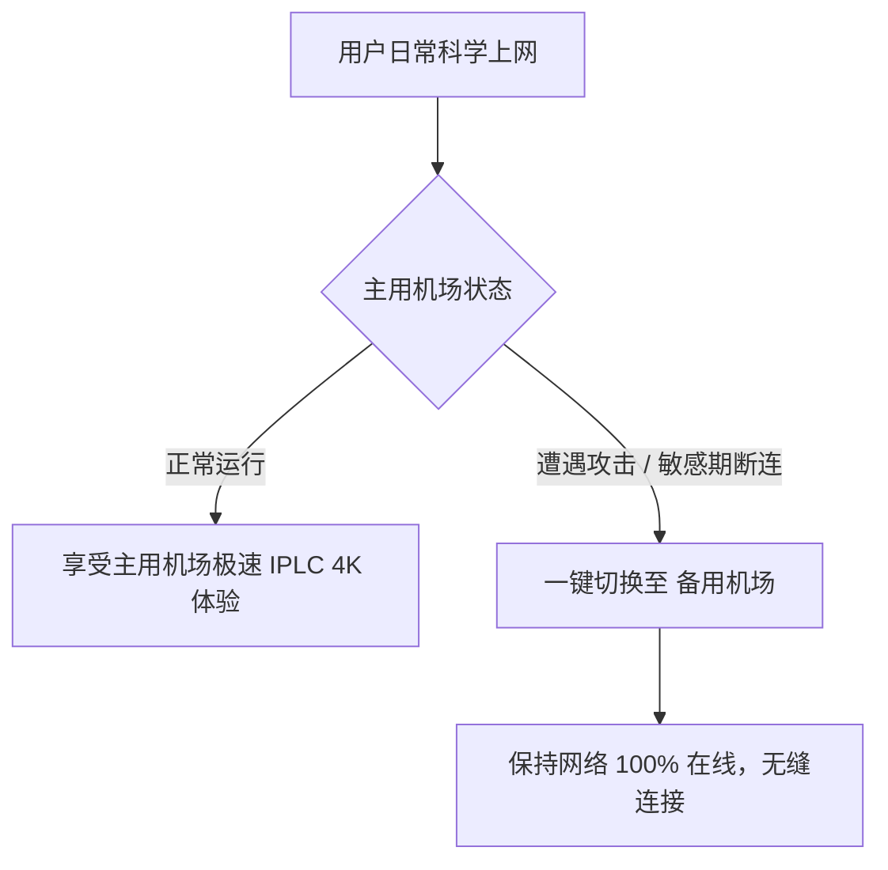

在科学上网的过程中，“单点故障”是每个用户都曾遭遇过的噩梦：**正准备提交重要文件或观看重要直播时，平时使用的主用机场突然遭受 DDoS 攻击或节点集中超时，导致整条网络彻底瘫痪**。

“不要把所有鸡蛋放在同一个篮子里”。本文为你梳理**防失联备用机场实力榜**，并教你如何用几块钱搭建低成本的“双机场冗余系统”。

---

## 防失联备用机场实力排行榜 (主打不限时流量与低月费)

作为备用机场，核心要求是：**没有月度清零压力（按量付费不限时）、单价极低、且在主用机场断连时能迅速救急**。

| 排名 | 机场品牌 | 备用套餐类型 | 备用流量单价 | 节点协议支持 | 备用推荐指数 |
| :--- | :--- | :--- | :--- | :--- | :--- |
| **TOP 1** | **梯子云 (Ladder)** | 不限时流量包 | ¥45 / 350GB (永不过期) | Hy2 / Trojan / SS | **9.8 / 10** |
| **TOP 2** | **极连云 (Jilian)** | 不限时流量包 | ¥39 / 300GB (永不过期) | 多线 BGP 中转 | **9.6 / 10** |
| **TOP 3** | **快狸 (KuaiLi)** | ¥9.9 迷你月付版 | ¥9.9 / 120GB / 月 | BGP 动漫专线 | **9.3 / 10** |
| **TOP 4** | **隐形人 (Invisible)** | 基础按月付费版 | ¥15.0 / 100GB / 月 | IPLC 物理专线 | **9.1 / 10** |

---

## 为什么你必须要配置“双机场备用系统”？

1. **应对敏感时期的集中封锁**：在每年敏感时期，某些机场的公网 IP 可能会被集中拦截。拥有不同线路入口的备用机场能确保你瞬间恢复连通。
2. **防范机场服务器 DDoS 攻击**：热门大机场经常沦为黑客攻击的目标，备用机场能帮你完美规避主线维修期间的断网真空期。
3. **分流大文件下载**：将主用专线机场的昂贵流量留给 4K 视频和游戏，把系统更新、Steam 游戏大文件下载交给廉价的备用机场执行。

---

## 客户端中如何配置“双机场自动故障转移”？

在 Clash Verge Rev、Stash 或 Sing-box 中，你可以将两个机场的订阅合并管理：

1. **导入双订阅**：在客户端中同时导入“主用机场”与“备用机场”两个订阅链接。
2. **创建 Fallback (故障转移) 节点组**：
   - 在客户端中创建一个 type: fallback 的策略组。
   - 将主用机场的主力节点放在第一位，备用机场的节点放在第二位。
   - 当客户端检测到第一位的节点 Ping 超时（连续 3 次无响应）时，**会自动在 1 秒内无感切换至备用节点**。

---

## 备用机场挑选 FAQ

### Q1：买一个不限时流量包作为备用，流量会被机场偷扣掉吗？
只要选择老牌公信力强的机场（如榜单推荐的梯子云、极连云），不限时流量包的扣费都是透明且按实际字节计算的，不用担心流量无故丢失。

### Q2：备用机场需要买很贵的专线套餐吗？
不需要。备用机场主要用于“救急查资料”与“下载”。购买几元钱的 BGP 中转或按量付费套餐即可，性价比极高。

---

## 备用机场组合总结

打造“主用专线机场 + 备用不限时流量机场”的**双系统冗余组合**，是实现科学上网 100% 稳定防失联的最佳实践。用极低的成本购买一份备用流量包，就能彻底告别突发断网的焦虑。